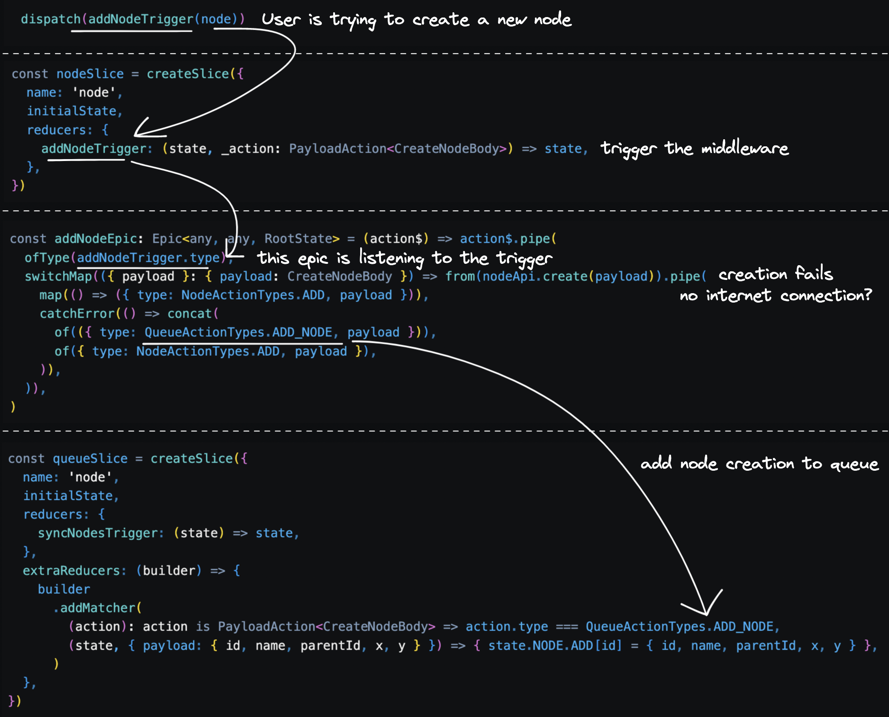

## Intro
### Conspiracy
Have you ever wondered how some websites (like [scalidraw.io](https://excalidraw.com)) are free and used on a large scale for storing lots of data? Can't sleep because of that unanswered question? Congrats! You're in the right place!

But before we dive in, let me share a little thought with you... When I watch the news, sometimes my phone starts burning as hell, sometimes to the point where the web browser crashes. What happened? There must be something resource-intensive under the hood. I don't believe text consumes so much processing. So what's the deal? Why does a simple news website require so much processing power? Maybe Steve Jobs was Satoshi Nakamoto and caused high traffic, leading the page to crash? I don't think so. Please disregard any sensationalist sources that make such claims. Just because an Apple developer hides a Bitcoin file into the Mac OS, doesn't mean someone is allowed to create an article saying "Confirmed. Steve Jobs was Satoshi Nakamoto". Until they want desperately people to click it and get money in return just -for example- by reading. The more you engage with their content, the more revenue they generate. 

Let me explain, uncle Satoshi created an algorithmic coin that, like Gold, becomes more valuable as time goes on. This is because the maximum amount of Bitcoins that can be mined is fixed at 21 million, unlike normal money, where governments keep printing more and more ~~every nanosecond~~ leading to its decreased value over time. The point is that the algorithms used to mine Bitcoin are so complex that individuals mining at home often spend more on electricity bills than they receive in rewards... Imagine if you were mining without even realizing it. Don't worry, I'm not secretly mining on your device.

We can also take advantage of the client's device, sometimes even leading to dispensing with the need for a server.

All right, after that amazing intro, let's get started.

### Objective
The idea in this article is to deal with a local approach where the user uses its own device to run the app (create, move, connect nodes and give them instructions) until they feel comfortable to create an account. Yep! No previous login as Tiktok does. You install it, you play it until you're addicted, then create an account to store, like, comment, and share these amazing kittens.

When I started this project, I had no idea (still) what I'm doing here. But, since it is important to have a solid structure, I just decided to proceed with a Redux offline-first approach. It would take a little longer but would keep working even if the user has a bad or suddenly no internet connection or the server goes down for any reason. But the best part is that it would be more resistant to bugs, easy to debug, and there would also be an improvement in user experience.

Talking about experience, I once worked on a project where we implemented offline support in a fast-paced environment where we didn't take enough time to think about the implementation. And since this is so interconnected with pretty much all the system, it ended up hindering the app development progress, similar to the following logarithmic curve:


<div className="caption">
  Implementation/Progress trade-off over time escenario
</div>

### Technical considerations
- To avoid the hassle of updating temporary IDs, unique IDs can be generated by the client for each Node.
- When syncing changes with the server, bulk operations can be performed in order of creation, update, and deletion.
- The prev item can be further optimized by cancelling unnecessary operations (e.g. don't update if later deleted).
- Nodes should be created by their parents first to avoid SQL error by creating a child with a non-existing parent_id.
- Using tools and patterns like Redux can be helpful in designing a well-thought-out mechanism.
- There are additional concerns to consider, such as conflict resolution and queue implementation.

## Implementation
### Libraries
I'm going to use a set of libraries that will help with implementing a solid base to start building from, these are:
- Redux: Predictable state container for JavaScript apps.
- Redux-toolkit: Toolset for efficient Redux development.
- Redux-observable: RxJS-based middleware for Redux. Compose and cancel async actions.
- Redux-persist: Persist and rehydrate a redux store.
- Async-storage: Storage engine.

### Flux architecture
Flux is a well-established pattern used to manage data flow in React applications. Redux, a popular implementation of Flux, efficiently handles asynchronous operations as illustrated here:

<div className="caption">
  https://redux.js.org/tutorials/fundamentals/part-6-async-logic
</div>

However, to further enhance this mechanism, let's extend it to support RxJS and persistence over a queue mechanism. By doing so, the resulting implementation will have the capability to handle complex data flows and ensure data persistence even in case of network disruptions. The following image demonstrates the end result:


<div className="caption">
  Redux queue flow
</div>


<div className="caption">
  Redux synchronization flow
</div>

### Code

<div className="caption">
  Simplified overview
</div>

I've created a `handleRemoteEpic` function to easily include operations other than "Add", it also avoids calling the API if the user is not logged in:
```tsx
const handleRemoteEpic = (actionType: string, apiMethod: (payload: any) => Promise<any>): Epic<any, any, RootState> => (action$, state$) => action$.pipe(
  ofType(actionType),
  debounceTime(DEBOUNCE_TIME),
  switchMap(({ payload }: { payload: any }) => (
    state$.value.login?.user
      ? from(apiMethod(payload)).pipe(
        map(() => ({ type: ActionEnumMap[actionType], payload })),
        catchError(() => storeLocalHandler(actionType, payload)),
      )
      : storeLocalHandler(actionType, payload) // no user logged in, nothing to save in the backend
  )),
)

const addNodeEpic = handleRemoteEpic(addNodeTrigger.type, nodeApi.create)
const deleteNodeEpic = handleRemoteEpic(deleteNodeTrigger.type, nodeApi.delete)
const updateNodeEpicRemote = handleRemoteEpic(updateNodeTrigger.type, nodeApi.update)
```

```tsx
const ActionEnumMap: Record<string, NodeActionTypes> = {
  [addNodeTrigger.type]: NodeActionTypes.ADD,
  [updateNodeTrigger.type]: NodeActionTypes.UPDATE,
  [deleteNodeTrigger.type]: NodeActionTypes.DELETE,
}

const QueueActionEnumMap: Record<string, QueueActionTypes> = {
  [addNodeTrigger.type]: QueueActionTypes.ADD_NODE,
  [updateNodeTrigger.type]: QueueActionTypes.UPDATE_NODE,
  [deleteNodeTrigger.type]: QueueActionTypes.DELETE_NODE,
}
const storeLocalHandler = (actionType: string, payload: any) => concat(
  of({ type: QueueActionEnumMap[actionType], payload }),
  of({ type: ActionEnumMap[actionType], payload }),
)
```

### Synchronization logic
After some offline activity, our queue should look something like this:
```js
QUEUE: {
  NODE: {
    ADD: {
      'some-client-side-generated-id': {
        id: 'some-client-side-generated-id',
        parentId: 'some-other-client-side-id',
        x: 300,
        y: 600,
      },
      'some-client-side-generated-id': {
        id: 'some-client-side-generated-id',
        parentId: 'some-other-client-side-id',
        x: 400,
        y: 800,
      },
    },
    UPDATE: {
      'some-client-side-generated-id': {
        id: 'some-client-side-generated-id',
        propsToUpdate: {
          x: 1200,
          y: 720,
        },
      },
    },
    DELETE: {
      'some-client-side-generated-id': {
        id: 'some-client-side-generated-id',
      },
      'some-client-side-generated-id': {
        id: 'some-client-side-generated-id',
      },
    }
  }
}
```

Let's iterate through and call the bulk-creation API
```tsx
const syncEpic: Epic<any, any, RootState> = (action$, state$) => action$.pipe(
  ofType(syncNodesTrigger.type),
  mergeMap(() => {
    const { ADD, UPDATE, DELETE }: QueueOperation<CreateNodeBody, UpdateNodeBody, DeleteNodeParams> = state$.value.queue.NODE
    const unsyncedNodes: { actionType: QueueActionTypes, payload: (CreateNodeBody | UpdateNodeBody | DeleteNodeParams) }[] = [
      ...Object.values(ADD).map((payload) => ({ actionType: QueueActionTypes.ADD_NODE, payload })),
      ...Object.values(UPDATE).map((payload) => ({ actionType: QueueActionTypes.UPDATE_NODE, payload })),
      ...Object.values(DELETE).map((payload) => ({ actionType: QueueActionTypes.DELETE_NODE, payload })),
    ]

    return unsyncedNodes.length === 0
      ? EMPTY
      : from(unsyncedNodes).pipe(groupBy((node) => node.actionType), mergeMap((group) => group.pipe(toArray())), concatMap((actionGroup) => {
        const { actionType } = actionGroup[0]

        switch (actionType) {
          case QueueActionTypes.ADD_NODE:
            return from(nodeApi.bulkCreate(actionGroup.map((action) => action.payload as CreateNodeBody))).pipe(
              mergeMap(() => actionGroup.map((action) => ({
                type: QueueActionTypes.DELETE_FROM_QUEUE,
                payload: { operation: 'ADD', id: (action.payload as CreateNodeBody).id },
              }))),
              catchError(() => EMPTY),
            )
          case QueueActionTypes.UPDATE_NODE:
            return from(nodeApi.bulkUpdate(actionGroup.map((action) => action.payload as UpdateNodeBody))).pipe(
              mergeMap(() => actionGroup.map((action) => ({
                type: QueueActionTypes.DELETE_FROM_QUEUE,
                payload: { operation: 'UPDATE', id: (action.payload as UpdateNodeBody).id },
              }))),
              catchError(() => EMPTY),
            )
          case QueueActionTypes.DELETE_NODE:
            return from(nodeApi.bulkDelete(actionGroup.map((action) => action.payload as UpdateNodeBody))).pipe(
              mergeMap(() => actionGroup.map((action) => ({
                type: QueueActionTypes.DELETE_FROM_QUEUE,
                payload: { operation: 'DELETE', id: (action.payload as DeleteNodeParams).id },
              }))),
              catchError(() => EMPTY),
            )
          default:
            return EMPTY
        }
      }))
  }),
)
```

### Server side
Finally, let's check if the current node in the bulk operation has an already non-inserted parent. If so, commit the transaction and start a new one for the upcoming inserts.
```tsx
export const runTransaction = async <T extends QueryResult>(queries: Array<{ query: string, id: string }>): Promise<T[]> => withConnection(async (client: PoolClient) => {
  try {
    await client.query('BEGIN')
    const results = await Promise.all(queries.map(({ query }) => client.query<T>(query)))
    await client.query('COMMIT')

    return results as T[]
  } catch (err) {
    console.error('Transaction error:', err)
    await client.query('ROLLBACK')
    throw err
  }
})
```
```tsx
export const createNodes = async (newNodes: SnakeCase<CreateNodeBody>[]): Promise<number | undefined> => {
  let transactionQueries: { query: string, id: string }[] = []
  const queryResult = []

  const commitTransaction = async () => {
    if (transactionQueries.length > 0) {
      const results = await runTransaction(transactionQueries)
      queryResult.push(...results)
      transactionQueries = []
    }
  }

  for (const node of newNodes) {
    const isParentInTransaction = transactionQueries.some((q) => q.id === node.parent_id)
    if (isParentInTransaction) await commitTransaction()

    const columns = Object.keys(node)
    const values = Object.values(node)
    const query = format('INSERT INTO %I (%I) VALUES (%L)', 'node', columns, values)

    transactionQueries.push({ query, id: node.id })
  }
  await commitTransaction()

  return queryResult.length
}
```

## Final result
I know it seems like some overhead, but hey, solid foundation, your future self will appreciate it 😉

You can take a tour of the full implementation here: https://github.com/Crsk/frow

Now that everything is implemented, you can try it by yourself. Go to https://crsk.github.io/frow/, turn off your internet connection, and start playing with the nodes.